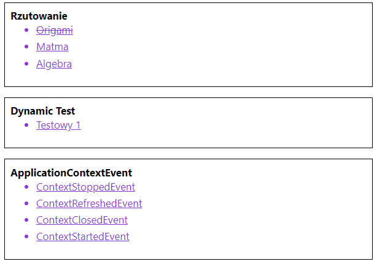

## ToDo-App - Projects & groups task manager application. 
#### A simple application that allows you to create projects, groups and tasks. It allows you to create a group of tasks and projects with specific tasks or groups of tasks. Each task group has a deadline for the last undone task.
  
### Technologies
Project is created with:
* Java 11
* Spring Framework 5
* Spring Boot 2 (ver. 2.2.2)
* Spring Data JPA (ver. 2.3.0)
* Spring Web MVC (ver. 5.2.7)
* Spring Dependency Injection
* Spring AOP (Aspect-Oriented Programming)
* Spring Security (ver. 5.3.3)
* Hibernate 
* Keycloak, OAuth 2.0
* JUnit 5
* Mockito
* AssertJ
* Maven

### About the application
#### 1) Application start at port 8080 (localhos:8080)
#### 2) Endpoint "/projects" is reserved only for the project manager (admin role). Here we can see Keycloak secutiry system used for login.

#### 3) Thanks to the form, we can easily add a project with tasks. The form has a validation system in thymeleaf framework.

#### 4) Endpoint "/groups" contains groups of tasks. Completed tasks are crossed out. We can enter any of the groups of tasks.

#### 5) Endpoint "/tasks" returns a view of all tasks with detailed information.

#### These are just a few of the main features of the program, in fact, there are many more.

##### Thanks for your attention ;) 
